# Code-SRWS

[](https://github.com/Tianfang-Zhang/SRWS)

[](./LICENSE)

This repository is for Self-Regularized Weighted Sparse (SRWS) model introduced in the following paper and is built in Matlab R2018a.

> Zhang T, Peng Z, Wu H, et al. [Infrared small target detection via self-regularized weighted sparse model](https://www.sciencedirect.com/science/article/pii/S0925231220313461)[J]. Neurocomputing, 420: 124-148.

For more information about me, you can visit my [persional website](https://tianfang-zhang.github.io/).

## Contents
1. [Introduction](#introduction)
2. [Method](#Method)
3. [Test](#test)
4. [Results](#results)
5. [Citation](#citation)

## Introduction
Infrared search and track (IRST) system is widely used in many fields, however, it’s still a challenging task to detect infrared small targets in complex background. This paper proposed a novel detection method called self-regularized weighted sparse (SRWS) model. The algorithm is designed for the hypothesis that data may come from multi-subspaces. And the overlapping edge information (OEI), which can detect the background structure information, is applied to constrain the sparse item and enhance the accuracy. Furthermore, the self-regularization item is applied to mine the potential information in background, and extract clutter from multi-subspaces. Therefore, the infrared small target detection problem is transformed into an optimization problem. By combining the optimization function with alternating direction method of multipliers (ADMM), we explained the solution method of SRWS and optimized its iterative convergence condition. A series of experimental results show that the proposed method outperforms state-of-the-art baselines.


<center>
    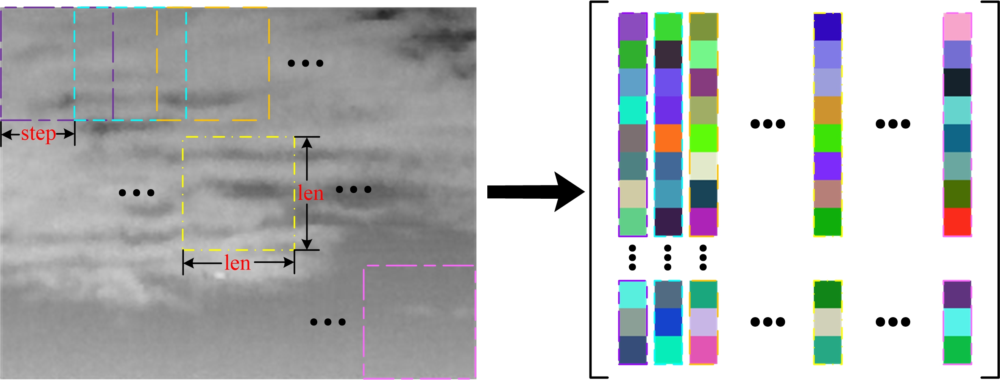
    <br>
    <div style="color:orange; border-bottom: 1px solid #d9d9d9;
    display: inline-block;
    color: #999;
    padding: 2px;">Figure 1. Illustration of infrared image conversion into patch image.</div>
</center>

<center>
    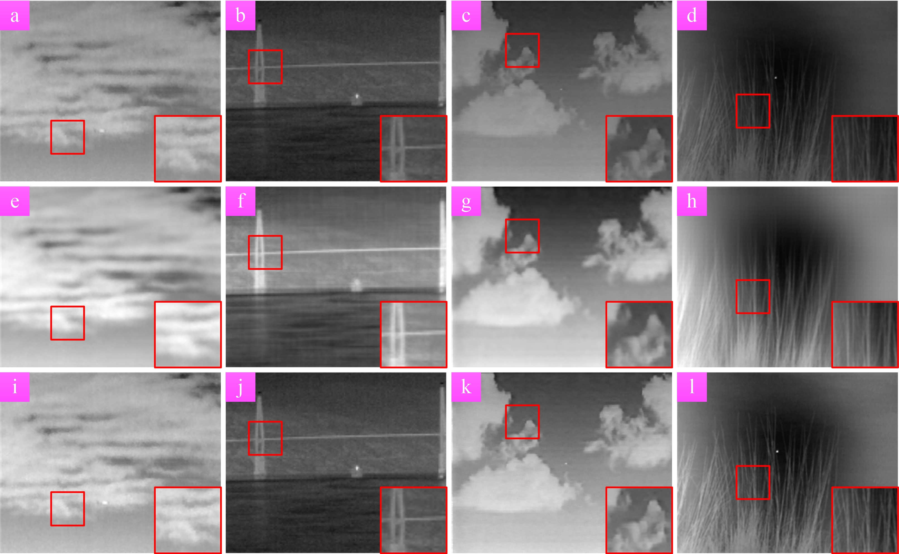
    <br>
    <div style="color:orange; border-bottom: 1px solid #d9d9d9;
    display: inline-block;
    color: #999;
    padding: 2px;">Figure 2. Illustration of background estimation capability. (a)-(d) are the original images; (e)-(h) are the background estimated by IPI, a single subspace method, and (i)-(l) are the background estimated by the multi-subspaces method SRWS proposed in this paper.</div>
</center>

## Method

<center>
    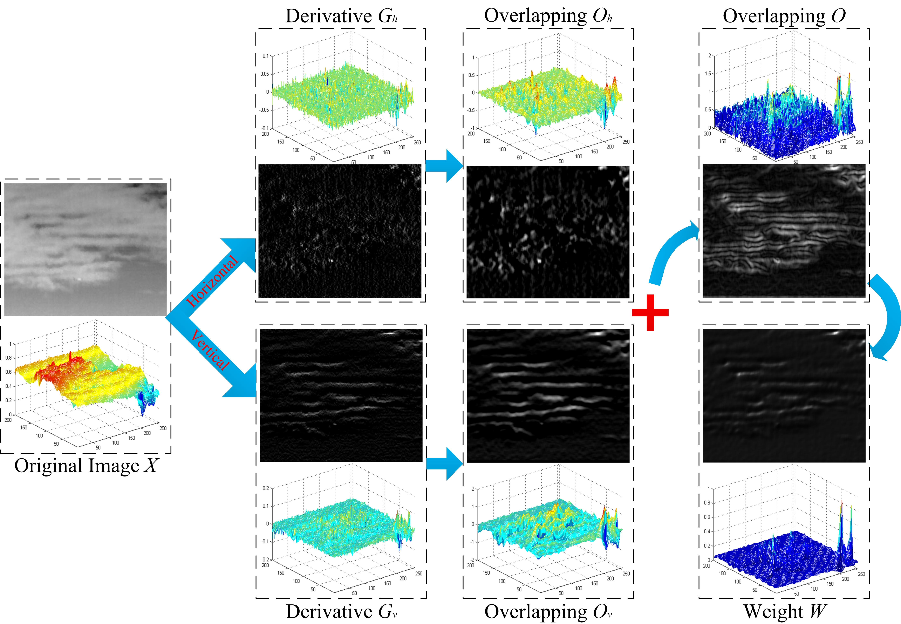
    <br>
    <div style="color:orange; border-bottom: 1px solid #d9d9d9;
    display: inline-block;
    color: #999;
    padding: 2px;">Figure 3. Flow chart for calculating OEI.</div>
</center>

<center>
    
    <br>
    <div style="color:orange; border-bottom: 1px solid #d9d9d9;
    display: inline-block;
    color: #999;
    padding: 2px;">Figure 4. Detection procedure of SRWS model.</div>
</center>

The iterative process of the SRWS model is given in the following tables.
<center>
    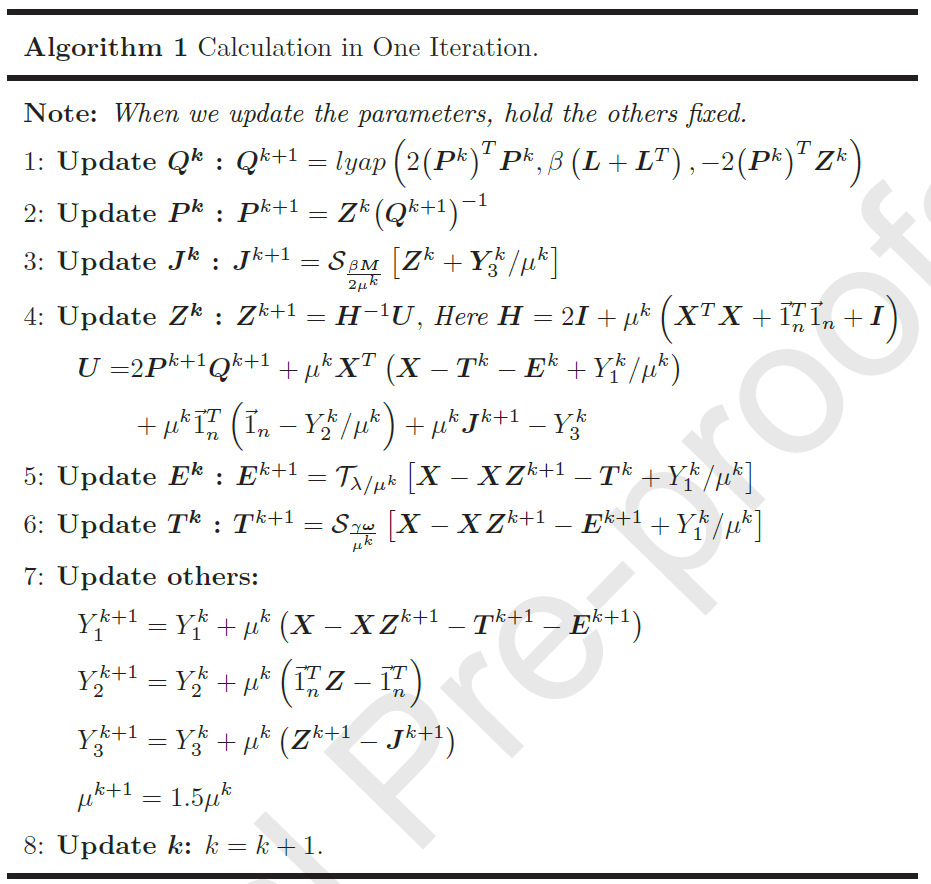
</center>

<center>
    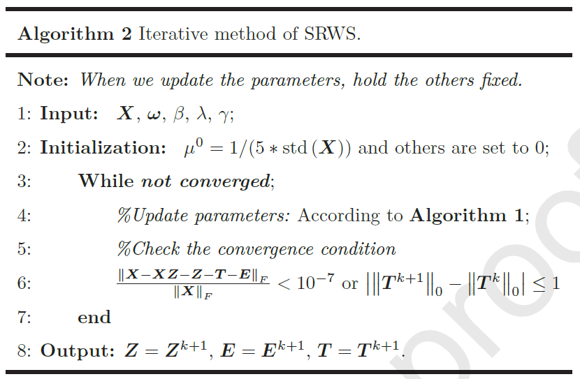
</center>


## Test
### Quick start
1. Download the code and test images in `./TestCode/`.

2. Modify the image path in the `demo.m`, and run the file.


## Results

### Visual Evaluation

#### Multi-Scene Adaptability

<center>
    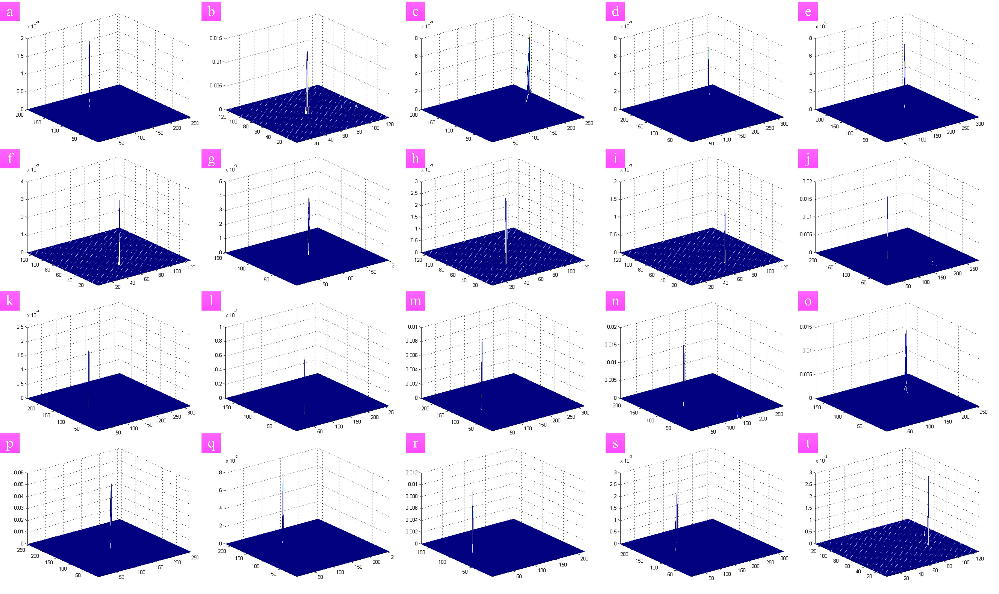
    <br>
    <div style="color:orange; border-bottom: 1px solid #d9d9d9;
    display: inline-block;
    color: #999;
    padding: 2px;">Figure 5. 3D display of SRWS model detecting complex background images.</div>
</center>  

<center>
    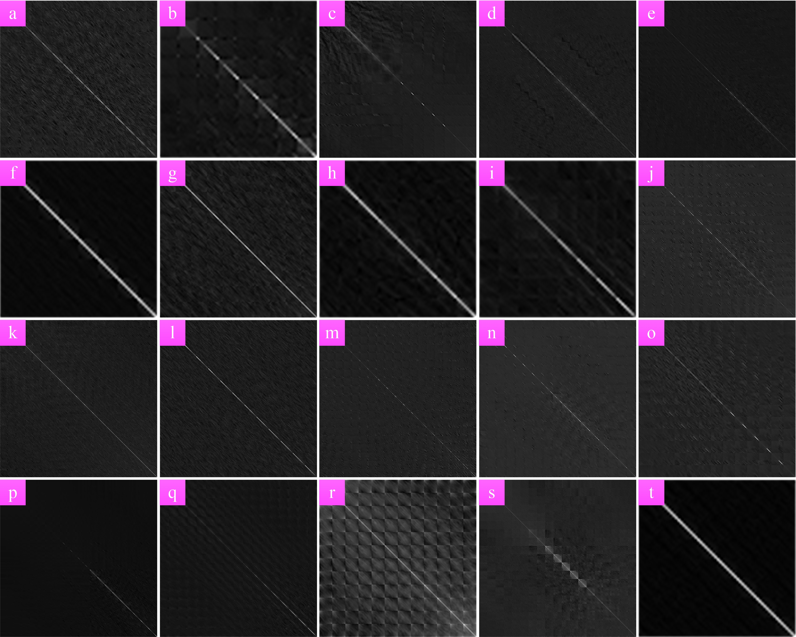
    <br>
    <div style="color:orange; border-bottom: 1px solid #d9d9d9;
    display: inline-block;
    color: #999;
    padding: 2px;">Figure 6. Illustration of SRWS coefficient matrix Z in complex background images.</div>
</center> 

<center>
    
    <br>
    <div style="color:orange; border-bottom: 1px solid #d9d9d9;
    display: inline-block;
    color: #999;
    padding: 2px;">Figure 7. Illustration of SRWS noise matrix E in complex background images.</div>
</center> 

####  Visual Comparison with Baselines

<center>
    
    <br>
    <div style="color:orange; border-bottom: 1px solid #d9d9d9;
    display: inline-block;
    color: #999;
    padding: 2px;">Figure 8. 3D disply of baselines comparison results in Seq. 1-3.</div>
</center>

<center>
    
    <br>
    <div style="color:orange; border-bottom: 1px solid #d9d9d9;
    display: inline-block;
    color: #999;
    padding: 2px;">Figure 9. 3D disply of baselines comparison results in Seq. 4-6.</div>
</center>

### Quantitative Evaluation

#### ROC 

<center>
    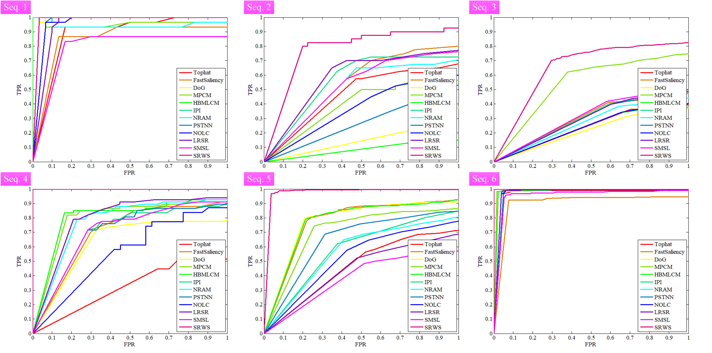
    <br>
    <div style="color:orange; border-bottom: 1px solid #d9d9d9;
    display: inline-block;
    color: #999;
    padding: 2px;">Figure 10. ROC of comparison methods.</div>
</center>

To better compare the AUC of each of the curves in Figure 10, their specific values are listed in the following table, where the maximum value of each sequence AUC is indicated in red and the second largest value is indicated in purple.

<center>
    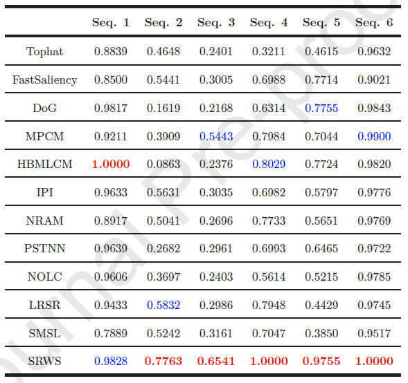
</center>

#### SCRG and BSF

<center>
    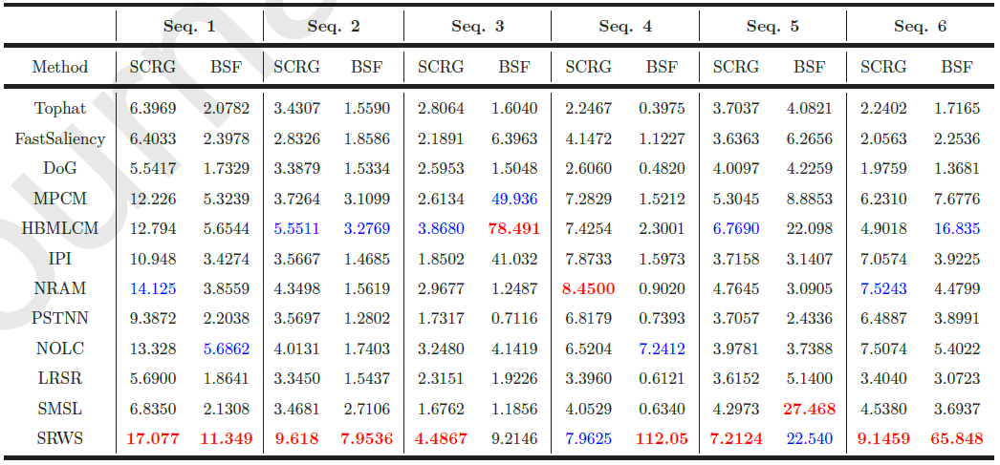
</center>

####  Iteration Number and Running Time

<center>
    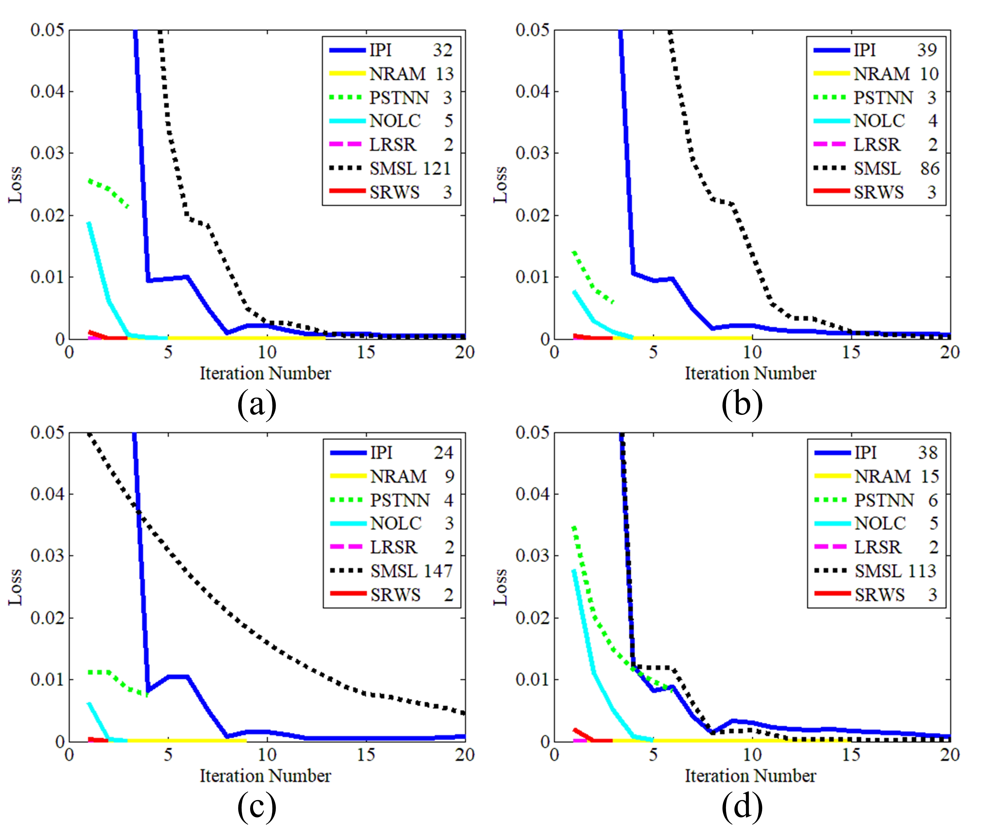
    <br>
    <div style="color:orange; border-bottom: 1px solid #d9d9d9;
    display: inline-block;
    color: #999;
    padding: 2px;">Figure 11. Iteration number comparison.</div>
</center>

<center>
    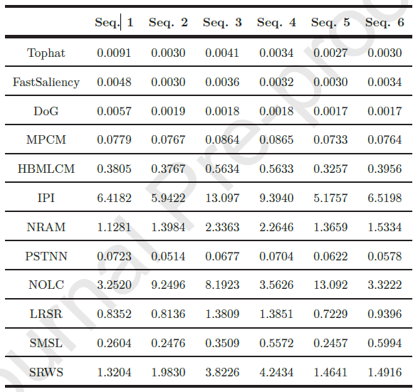
</center>

For more information, please refer to our [paper](https://www.sciencedirect.com/science/article/pii/S0925231220313461)

## Citation
If you find the code helpful in your resarch or work, please cite the following papers.

> Zhang T, Peng Z, Wu H, et al. [Infrared small target detection via self-regularized weighted sparse model](https://www.sciencedirect.com/science/article/pii/S0925231220313461)[J]. Neurocomputing, 420: 124-148.

```
@article{zhang420infrared,
  title={Infrared small target detection via self-regularized weighted sparse model},
  author={Zhang, Tianfang and Peng, Zhenming and Wu, Hao and He, Yanmin and Li, Chaohai and Yang, Chunping},
  journal={Neurocomputing},
  volume={420},
  pages={124--148},
  publisher={Elsevier}
}
```
